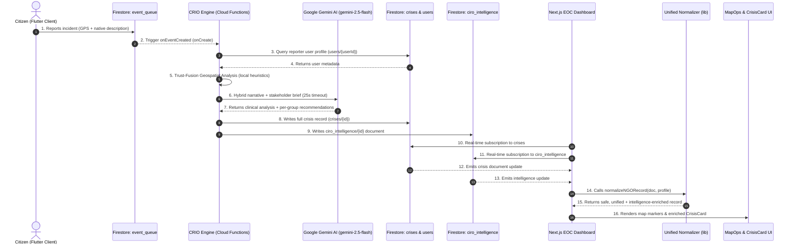

# CrisisNexus: NGO Emergency Response & Intelligence System

CrisisNexus is a production-grade, highly resilient disaster response coordination platform. The system connects ground-level citizen reports with centralized Non-Governmental Organization (NGO) Emergency Operations Centers (EOC) by combining real-time mobile telemetry with a dual-mode AI reasoning engine — the **CRIO (Crisis Response Intelligence Orchestrator)**. Designed for high availability under network and API degradation, CrisisNexus guarantees absolute data integrity through a zero-fabrication normalizer.

---

## 🧭 1. Project Overview

CrisisNexus bridges the operational visibility gap between distressed citizens and aid agencies during critical disasters.

* **What it is**: A distributed coordination suite consisting of a Flutter-based citizen app, Firebase serverless backend, real-time command center interface, and an automated decision-support pipeline powered by Google Gemini AI.
* **Why it exists**: During major disasters, humanitarian operations are crippled by data noise, unverified reports, map-rendering crashes due to corrupt coordinates, and AI engines fabricating geographic contexts. CrisisNexus provides an authoritative, non-crashing telemetry platform.
* **The Ingestion Pipeline**: Live citizen alerts flow from mobile devices into a high-concurrency event queue, where serverless triggers run geospatial trust-fusion analysis, call Gemini for clinical narrative generation and stakeholder-specific recommendations, and update the reactive Next.js dashboard in real time.

---

## 🏗️ 2. System Architecture

CrisisNexus operates on a serverless, event-driven topology. Below is the end-to-end ingestion and visualization architecture:



### Key Architectural Layers:
1. **Citizen Telemetry Ingestion (Flutter)**: Native mobile app utilizing location sensors to capture high-accuracy raw GPS coordinates, system telemetry, and user input.
2. **CRIO Serverless Processing (Firebase Functions)**: Event-driven cloud function triggered on queue updates, orchestrating data decoration, trust-fusion scoring, and Gemini AI calls.
3. **AI Decision-Support Engine (Gemini / AI Studio)**: Structured prompt parsing leveraging `gemini-2.5-flash` to generate clinical narratives and per-stakeholder tactical recommendations without narrative fabrication.
4. **CIRO Intelligence Collection (`ciro_intelligence`)**: A dedicated Firestore collection storing the full AI analysis output, decoupled from the raw crisis record to preserve citizen truth supremacy.
5. **Data Normalization Layer (Next.js Lib)**: A zero-fabrication normalizer sitting directly before UI compilation, merging intelligence fields into the display record without overwriting citizen-authored data.
6. **Real-time Visualization (Google Maps API)**: Rigid numeric validation layer safeguarding map rendering boundaries against coordinate anomalies.

---

## 🔄 3. Core Workflow

The life cycle of an incident is tracked across seven distinct stages:

### Stage 1: Citizen Reporting
* The ground user triggers an emergency via the Flutter client.
* The application captures GPS coordinates (latitude, longitude, accuracy radius) along with a native text description.
* The packet is written to `event_queue/{id}` in Firestore.

### Stage 2: CRIO Processing
* An event-driven Cloud Function (`crisisProcessor.js`) triggers on document creation.
* The system runs a **Trust-Fusion Geospatial Analysis** locally (no API dependency) to compute initial severity, confidence, and escalation pattern.
* The system then selects between **Hybrid Mode** (trust-fusion + Gemini narrative) or **Pure Fallback** (trust-fusion only) based on API availability.

### Stage 3: Intelligence Generation (CRIO v2)
* Under standard production paths, **Gemini AI** (`gemini-2.5-flash`) receives the fused sensor data and generates:
  * **`reasoning`** — A 2-3 sentence clinical intelligence brief (authoritative EOC tone, no hashtags).
  * **`stakeholderMessages`** — Four targeted action briefs, one per stakeholder group:
    * `public` — Alert message for citizens in the impact zone.
    * `hospitals` — Medical facility readiness instructions.
    * `police` — Law enforcement deployment directives.
    * `utilities` — Infrastructure and grid monitoring guidance.
  * **`affectedPopulation`** — AI-estimated headcount of impacted civilians.
  * **`confidence`** — Gemini's confidence score, bounded-adjusted against the trust-fusion baseline (±0.05 max delta to prevent fabrication).
* The Gemini API call uses a **25-second AbortController timeout** to accommodate `gemini-2.5-flash` thinking tokens without silent failures.

### Stage 4: Crisis & Intelligence Storage
* The decorated incident is committed to the `crises/{id}` collection in Firestore.
* A separate `ciro_intelligence/{id}` document is written, containing the full CRIO analysis output:

```
ciro_intelligence/{id}
├── linkedCrisisId       — References the parent crisis document
├── aiMode               — "hybrid" | "gemini_primary" | "local_fallback"
├── reasoning            — Gemini clinical narrative (maps → aiSummary on card)
├── recommendedActions   — ["public: ...", "hospitals: ...", "police: ...", "utilities: ..."]
├── analysis             — { severity, confidence, escalationPattern, isCrisis, ... }
├── inputs               — Raw sensor fusion data (weather, GPS, agreement score)
├── geoCluster           — { lat, lng, radiusKm }
├── rawDecision          — Full Gemini JSON response
│   └── crises[0]
│       └── affectedPopulation — AI-estimated affected civilian count
├── fallbackReason       — "timeout" | "missing_key" | null (null = Gemini succeeded)
└── timestamp
```

### Stage 5: NGO Dashboard Reactive Update
* The Next.js NGO Dashboard is subscribed to both `crises` and `ciro_intelligence` collections.
* The `CrisisCard` component fetches the matching intelligence document by `linkedCrisisId`.
* The normalizer merges intelligence fields into the display record using a **non-destructive merge** strategy — citizen-authored truth is never overwritten.

### Stage 6: Map Operations Visualization
* The dashboard maps the normalized data into `MapOpsLayer.tsx`.
* Telemetry coordinate fields are scanned. If coordinates are non-numeric, null, or out of range, the normalizer flags `safeForMap = false`.
* The Google Maps wrapper filters out invalid coordinates, plotting only verified nodes to completely prevent Map interface crashes.

### Stage 7: Dispatch Cycle
The incident response follows a rigid, three-phase sign-off sequence:
1. **Medical Team Approval**: Medical directors evaluate physiological metrics.
2. **Coordination Team Approval**: Search and Rescue coordinators assess spatial boundaries.
3. **Logistics Dispatch Approval**: Dispatch officers assign inventory and personnel.
4. **Final Field Execution**: Teams depart, changing the event status as:
   `NEW` ➔ `TRIAGED` ➔ `ASSIGNED` ➔ `RESOLVED`.

---

## 🏥 4. Three Real-World Scenarios

### Scenario 1: Medical Emergency (High Priority)
* **The Telemetry Inflow**: A citizen reports an active cardiac arrest. Flutter captures high-accuracy coordinates inside a residential cluster.
* **CRIO Processing**: CRIO detects medical keywords, evaluates the reporter's history, queries the `users` profile, and uses the environment-based Gemini API injection layer to classify severity as `CRITICAL` with a priority score of `95`.
* **NGO Command & Dispatch**: The incident pops to the top of the reactive Relief Queue showing the verified reporter's name. The CrisisCard displays Gemini's clinical brief in the AI Summary field and four stakeholder action items (Hospitals, Police, Public, Utilities). The Medical Team instantly reviews the raw observation text, signs off triage, and dispatches a dedicated ambulance to the exact GPS coordinates plotted safely on the Operations Map.

### Scenario 2: Natural Disaster (Flood / Earthquake)
* **The Telemetry Inflow**: Flash flooding impacts an entire coastal district. Dozens of reports flow into the `event_queue` containing erratic coordinate telemetry and mixed descriptive signals.
* **CRIO Processing**: The trust-fusion engine categorizes the geographic cluster. If the Gemini API is unavailable, the system falls back to the local heuristic engine. Fallback recommendations (hospitals, police, utilities) are still generated to ensure coordinators have actionable guidance even without AI.
* **NGO Command & Dispatch**: The Operations Map aggregates reports into spatial density clusters. A circular emergency impact radius marker displays on the map. Search and Rescue teams coordinate logistics assets to execute mass evacuation routes around the telemetry centers.

### Scenario 3: Simulation / False Positive Evaluation
* **The Telemetry Inflow**: A user accidentally triggers an alert or submits an empty request during testing.
* **CRIO Processing**: The Gemini AI evaluates the sparse descriptive text, resulting in a low confidence score (`confidenceScore < 0.40`). The engine flags the incident as low severity.
* **NGO Command & Dispatch**: The normalizer flags the incident as `UNVERIFIED`. The Crisis Ops panel renders a gray verification warning badge on the crisis card. The dispatch team reviews the card, recognizes it as a false alarm, and archives it without dispatching rescue personnel, preserving valuable humanitarian resources.

---

## 🧩 5. Key Components

* **`crisisProcessor.js` (Cloud Functions)**: The core CRIO processing engine. Orchestrates database writes, trust-fusion analysis, Gemini AI calls (with 25s timeout), and writes both `crises` and `ciro_intelligence` documents.
* **`normalizeNGORecord.ts` (Next.js Lib)**: The single source of truth for the dashboard. Isolates raw citizen text from AI overlays, validates coordinates mathematically, binds profiles, and merges intelligence fields without overwriting citizen truth.
* **`CrisisCard.tsx` (Next.js Component)**: Displays critical incident information. Fetches the matching `ciro_intelligence` document by `linkedCrisisId`, maps `reasoning` → AI Summary field, and renders per-stakeholder recommendations (Public/Hospitals/Police/Utilities) with dedicated icons and color codes. Also surfaces Gemini's `affectedPopulation` estimate in the Impact metric chip.
* **`MapOpsLayer.tsx` (Next.js Component)**: Renders the Google Maps viewport. Safely handles circular radius boundaries and validates coordinate numbers to prevent component-level map crashes.
* **`DataQualityLayer.tsx` (Next.js Component)**: Dynamically displays telemetry reliability badges and flags degraded records only when coordinates are physically missing.
* **`resourcePlanner.js` (CRIO Module)**: Allocates resources based on severity from the `resources` Firestore collection. Returns empty array when no resources exist — never fabricates available units.

---

## 🧠 6. AI & Fusion Engine Mechanics

CrisisNexus features a robust, hybrid intelligence architecture designed to optimize operational efficiency while maintaining strict data reliability:

```
                  ┌──────────────────────────────┐
                  │   Incoming Citizen Report    │
                  └──────────────┬───────────────┘
                                 │
                 ┌───────────────▼───────────────┐
                 │   Trust-Fusion Geospatial     │
                 │   Analysis (local, no API)    │
                 │   ── severity, confidence,    │
                 │   ── escalation, geo-cluster  │
                 └───────────────┬───────────────┘
                                 │
               ┌─────────────────┴─────────────────┐
               │        Gemini API Call            │
               │    (25s timeout, gemini-2.5-flash)│
               └─────────────┬─────────────────────┘
                             │
               ┌─────────────┴──────────────┐
               │                            │
     [Gemini Succeeds]           [Timeout / API Error]
               │                            │
  ┌────────────▼─────────────┐  ┌──────────▼────────────────┐
  │      HYBRID MODE         │  │     LOCAL FALLBACK MODE   │
  │  Trust-fusion scores     │  │  Trust-fusion scores only │
  │  + Gemini narrative      │  │  Heuristic recommendations│
  │  + Stakeholder briefs    │  │  fallbackReason = timeout │
  │  + affectedPopulation    │  └───────────────────────────┘
  │  confidence ±0.05 bounded│
  └──────────────────────────┘
               │
  ┌────────────▼───────────────────────┐
  │  ciro_intelligence/{id} written    │
  │  crises/{id} written               │
  └────────────────────────────────────┘
```

### Gemini Output Schema (`ciro_intelligence.rawDecision`):
```json
{
  "crises": [{
    "type": "Medical | Flood | Earthquake | ...",
    "severity": "LOW | MEDIUM | HIGH | CRITICAL",
    "confidence": 0.0,
    "affectedPopulation": 15000,
    "expectedDurationHours": 12,
    "escalationPattern": "Stable | Worsening | Improving | Unknown"
  }],
  "stakeholderMessages": {
    "public":    "Alert citizens in the affected area...",
    "hospitals": "Prepare emergency capacity for...",
    "police":    "Deploy traffic control units at...",
    "utilities": "Monitor drainage and power grid systems..."
  },
  "confidence": 0.85,
  "systemExplanation": "Clinical 2-3 sentence intelligence brief..."
}
```

### Confidence Bounded-Adjustment Rule:
To prevent Gemini from overriding authoritative local heuristics, confidence is adjusted with a strict ±0.05 cap:
$$\text{Final Confidence} = \text{FusionScore} + \text{clamp}(\text{GeminiConfidence} - \text{FusionScore},\ {-0.05},\ {+0.05})$$

### Risk Evaluation Matrix:
$$\text{Priority Score} = (\text{Base Severity} \times 0.6) + (\text{Telemetry Reliability} \times 0.4)$$
This matrix ranks incidents dynamically, prioritizing high-accuracy mobile telemetry reports over unverified, low-confidence entries.

---

## 🔐 7. Data Integrity Rules

To guarantee trustworthy humanitarian operations, the platform adheres to strict data integrity constraints:

1. **Citizen Truth Supremacy**: Raw descriptions written by ground citizens are never replaced, truncated, or overwritten by AI-generated summaries. The original citizen observation is always the primary visual text on the NGO dashboard.
2. **Non-Destructive Intelligence Merge**: `ciro_intelligence` fields are merged into the display record using `??` (nullish coalescing) — existing citizen or crisis fields always take precedence.
3. **Geographic Authenticity**: No synthetic location names are injected unless explicitly recorded by a citizen on the ground.
4. **Strict Location Validation**: Coordinates are parsed and validated using a rigorous numeric check (`isFinite && !isNaN`). If validation fails, `safeForMap` is set to `false`, and the map controller bypasses plotting to prevent interface crashes.
5. **Zero Fabrication Fallback**: When Gemini is unavailable, heuristic recommendations are used (`fallbackReason` is written to the intelligence document). The UI transparently shows the AI mode in the card header. No synthetic population counts, coordinates, or narratives are injected.
6. **Identity Resolution Protocol**: Names are resolved using a secure hierarchy:
   $$\text{User DisplayName} \rightarrow \text{User Profile Name} \rightarrow \text{Citizen Input Name} \rightarrow \text{"Unknown"}$$

---

## ⚡ 8. Tech Stack

* **Frontend**: Next.js (TypeScript, TailwindCSS, React Hooks, Lucide Icons)
* **Mobile**: Flutter (Dart, Firebase Auth, Geolocator Core)
* **Backend**: Firebase Cloud Functions (Node.js, Firebase Admin SDK)
* **Database**: Firebase Firestore (Real-time active listener subscriptions)
* **Intelligence Layer**: Google Gemini AI (`gemini-2.5-flash`, Google AI Studio SDK, 25s timeout)
* **Maps Engine**: Google Maps API (Google Maps React Wrappers)
* **Project ID**: `crisisnexus-bf9fc`

---

## 🚀 9. Deployment Flow

### 1. Cloud Functions Deployment
Install dependencies and deploy the CRIO serverless backend to Google Cloud Platform:
```bash
cd crisis_nexus/functions
npm install
firebase deploy --only functions --project crisisnexus-bf9fc
```

### 2. Next.js Dashboard (Dev)
Run the NGO Command Center dashboard locally:
```bash
cd crisis_nexus_ngo
npm install
npm run dev
# Open http://localhost:3000
```

### 3. Flutter Citizen App
```bash
cd crisis_nexus
flutter pub get
flutter run
```

### 4. Firebase Environment Configuration
Ensure your Gemini API key is securely injected into the production environment:
```bash
firebase functions:config:set gemini.key="YOUR_AI_STUDIO_KEY" --project crisisnexus-bf9fc
```

---

## 📊 10. `ciro_intelligence` Firestore Schema Reference

| Field | Type | Description |
|---|---|---|
| `linkedCrisisId` | `string` | ID of the parent `crises/{id}` document |
| `aiMode` | `string` | `"hybrid"` / `"gemini_primary"` / `"local_fallback"` |
| `reasoning` | `string` | Gemini clinical narrative → rendered as AI Summary on card |
| `recommendedActions` | `string[]` | `["public: ...", "hospitals: ...", "police: ...", "utilities: ..."]` |
| `analysis.severity` | `string` | Trust-fusion severity: `Low` / `Medium` / `High` / `Critical` |
| `analysis.confidence` | `number` | Bounded-adjusted confidence score (0.0 – 1.0) |
| `analysis.escalationPattern` | `string` | `Stable` / `Worsening` / `Improving` / `Unknown` |
| `analysis.isCrisis` | `boolean` | Whether the fusion engine determined this is a real crisis |
| `rawDecision.crises[0].affectedPopulation` | `number\|null` | Gemini-estimated civilian impact count |
| `geoCluster` | `{ lat, lng, radiusKm }` | Geospatial cluster center and impact radius |
| `inputs` | `object` | Raw sensor data: weather, GPS, agreementScore, fusionScore |
| `fallbackReason` | `string\|null` | `null` = Gemini succeeded; `"timeout"` / `"missing_key"` = fallback used |
| `timestamp` | `Timestamp` | Document creation time |

---

## 📌 11. Final Summary

CrisisNexus represents a battle-hardened, production-ready design for emergency operations. The **CRIO v2 Intelligence Engine** delivers:

- **Clinical AI Narratives**: Gemini generates authoritative, non-fabricated summaries mapped directly to the EOC dashboard card.
- **Per-Stakeholder Recommendations**: Four targeted action groups (Public, Hospitals, Police, Utilities) rendered with dedicated icons and color codes for instant coordinator comprehension.
- **Affected Population Estimates**: Gemini's civilian impact count surfaced in the Impact metric chip on every crisis card.
- **Resilient AI Pipeline**: A 25-second timeout (up from 8s) ensures `gemini-2.5-flash` thinking tokens complete without silent failures. When unavailable, deterministic heuristic fallbacks maintain full operational capability.
- **Zero-Fabrication Guarantee**: The non-destructive intelligence merge ensures citizen-authored truth is never overwritten, while AI intelligence only enriches — never replaces — verified telemetry.
