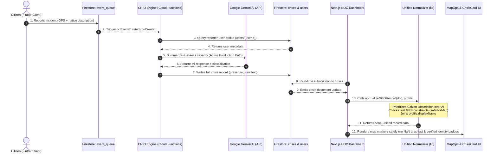

# CrisisNexus: NGO Emergency Response & Intelligence System

CrisisNexus is a production-grade, highly resilient disaster response coordination platform. The system connects ground-level citizen reports with centralized Non-Governmental Organization (NGO) Emergency Operations Centers (EOC) by combining real-time mobile telemetry with a dual-mode AI reasoning engine. Designed for high availability under network and API degradation, CrisisNexus guarantees absolute data integrity through a zero-fabrication normalizer.

---

## 🧭 1. Project Overview

CrisisNexus bridges the operational visibility gap between distressed citizens and aid agencies during critical disasters.

* **What it is**: A distributed coordination suite consisting of a Flutter-based citizen app, Firebase serverless backend, real-time command center interface, and an automated decision-support pipeline.
* **Why it exists**: During major disasters, humanitarian operations are crippled by data noise, unverified reports, map-rendering crashes due to corrupt coordinates, and AI engines fabricating geographic contexts. CrisisNexus provides an authoritative, non-crashing telemetry platform.
* **The Ingestion Pipeline**: Live citizen alerts flow from mobile devices into a high-concurrency event queue, where serverless triggers query user identity databases, run Gemini-powered risk assessments, append machine intelligence, and update the reactive Next.js dashboard and live Operations Map instantly.

---

## 🏗️ 2. System Architecture

CrisisNexus operates on a serverless, event-driven topology. Below is the end-to-end ingestion and visualization architecture:



### Key Architectural Layers:
1. **Citizen Telemetry Ingestion (Flutter)**: Native mobile app utilizing location sensors to capture high-accuracy raw GPS coordinates, system telemetry, and user input.
2. **CRIO Serverless Processing (Firebase Functions)**: Event-driven cloud function triggered on queue updates, orchestrating data decoration and AI calls.
3. **AI Decision-Support Engine (Gemini / AI Studio)**: Structured prompt parsing leveraging production-safe environment variables to class incidents without narrative fabrications.
4. **Data Normalization Layer (Next.js Lib)**: A zero-fabrication normalizer sitting directly before UI compilation to standardize telemetry variables and enforce truth safety.
5. **Real-time Visualization (Google Maps API)**: Rigid numeric validation layer safeguarding map rendering boundaries against coordinate anomalies.

---

## 🔄 3. Core Workflow

The life cycle of an incident is tracked across seven distinct stages:

### Stage 1: Citizen Reporting
* The ground user triggers an emergency via the Flutter client.
* The application captures GPS coordinates (latitude, longitude, accuracy radius) along with a native text description.
* The packet is written to `event_queue/{id}` in Firestore.

### Stage 2: CRIO Processing
* An event-driven Cloud Function (`crisisProcessor.js`) triggers on document creation.
* The system evaluates upstream API and connectivity status. It selects between **Production Mode** (standard Gemini execution) or **Safe Fallback Mode** (deterministic structured parsing) to ensure no pipeline blockage occurs.
* Initial severity and confidence scores are calculated.

### Stage 3: Intelligence Generation
* Under standard production paths, Gemini AI compiles an `aiSummary` and populates the `decisionEngine` metadata:
  * `riskLevel` (e.g., HIGH, MEDIUM, LOW)
  * `priorityScore` (0 to 100 based on threat complexity)
  * `recommendedAction` (immediate tactical recommendation)

### Stage 4: Crisis Storage
* The decorated incident is committed to the `crises/{id}` collection in Firestore.
* The incident's `userId` references the `users/{userId}` user profile collection to preserve trace paths.

### Stage 5: NGO Dashboard Reactive Update
* The Next.js NGO Dashboard is actively subscribed to the `crises` collection.
* The incoming document is instantly passed to `normalizeNGORecord()`.
* The normalizer parses the records, enforces strict citizen text priority, and ensures that identity resolution is joined from the profile.

### Stage 6: Map Operations Visualization
* The dashboard maps the normalized data into `MapOpsLayer.tsx`.
* Telemetry coordinate fields are scanned. If coordinates are non-numeric, null, or out of range, the normalizer flags `safeForMap = false`.
* The Google Maps wrapper filters out invalid coordinates, plotting only verified nodes to completely prevent Map interface crashes.

### Stage 7: Dispatch Cycle
The incident response follows a rigid, three-phase sign-off sequence:
1. **Medical Team Approval**: Medical directors evaluate physiological metrics.
2. **Coordination Team Approval**: Search and Rescue coordinators assess spatial boundaries.
3. **Logistics Dispatch Approval**: Dispatch officers assign inventory and personnel.
4. **Final Field Execution**: Teams depart, changing the event status as:
   `NEW` ➔ `TRIAGED` ➔ `ASSIGNED` ➔ `RESOLVED`.

---

## 🏥 4. Three Real-World Scenarios

### Scenario 1: Medical Emergency (High Priority)
* **The Telemetry Inflow**: A citizen reports an active cardiac arrest. Flutter captures high-accuracy coordinates inside a residential cluster.
* **CRIO Processing**: CRIO detects medical keywords, evaluates the reporter's history, queries the `users` profile, and uses the environment-based Gemini API injection layer to classify severity as `CRITICAL` with a priority score of `95`.
* **NGO Command & Dispatch**: The incident pops to the top of the reactive Relief Queue showing the verified reporter's name: **Muhammad Ayan Hashmi**. The Medical Team instantly reviews the raw observation text, signs off triage, and dispatches a dedicated ambulance to the exact GPS coordinates plotted safely on the Operations Map.

### Scenario 2: Natural Disaster (Flood / Earthquake)
* **The Telemetry Inflow**: Flash flooding impacts an entire coastal district. Dozens of reports flow into the `event_queue` containing erratic coordinate telemetry and mixed descriptive signals.
* **CRIO Processing**: The engine categorizes the geographic cluster. Upstream APIs experience a sudden rush, triggering refined circuit-breaker parameters which gracefully maintain system stability. The CRIO engine switches to **Safe Fallback Mode**, ensuring that no synthetic geographic zones are injected and that raw coordinate tables are cleanly preserved.
* **NGO Command & Dispatch**: The Operations Map aggregates reports into spatial density clusters. A circular emergency impact radius marker displays on the map. Search and Rescue teams coordinate logistics assets to execute mass evacuation routes around the telemetry centers.

### Scenario 3: Simulation / False Positive Evaluation
* **The Telemetry Inflow**: A user accidentally triggers an alert or submits an empty request during testing.
* **CRIO Processing**: The Gemini AI evaluates the sparse descriptive text, resulting in a low confidence score (`confidenceScore < 0.40`). The engine flags the incident as low severity and sets `review_required = true`.
* **NGO Command & Dispatch**: The normalizer flags the incident as `UNVERIFIED`. The Crisis Ops panel renders a gray verification warning badge on the crisis card. The dispatch team reviews the card, recognizes it as a false alarm, and archiving it without dispatching rescue personnel, preserving valuable humanitarian resources.

---

## 🧩 5. Key Components

* **`normalizeNGORecord.ts` (Next.js Lib)**: The single source of truth for the dashboard. It isolates raw citizen text from AI overlays, validates coordinates mathematically, binds profiles, and prevents UI crashes.
* **`CrisisCard.tsx` (Next.js Component)**: Displays critical incident information, showing the **HIGH REALITY** validation badge for real GPS coordinates, and ensuring original descriptions have absolute UI priority over AI.
* **`MapOpsLayer.tsx` (Next.js Component)**: Renders the Google Maps viewport. Safely handles circular radius boundaries and validates coordinate numbers to prevent component-level map crashes.
* **`DataQualityLayer.tsx` (Next.js Component)**: Dynamically displays telemetry reliability badges and flags degraded records only when coordinates are physically missing.
* **`crisisProcessor.js` (Cloud Functions)**: The core node processing engine that coordinates database writes, user identity queries, Gemini AI classification pipelines, and circuit breaker logic.

---

## 🧠 6. AI & Fusion Engine Mechanics

CrisisNexus features a robust, hybrid intelligence architecture designed to optimize operational efficiency while maintaining data reliability:

```
                  ┌──────────────────────────────┐
                  │   Incoming Citizen Report    │
                  └──────────────┬───────────────┘
                                 │
                 ┌───────────────▼───────────────┐
                 │    CRIO Processing Trigger    │
                 └───────────────┬───────────────┘
                                 │
               ┌─────────────────┴─────────────────┐
               │    Upstream Connectivity Check    │
               └─────────┬─────────────────┬───────┘
                         │                 │
              [Healthy Connect]      [API Rate Limited]
                         │                 │
        ┌────────────────▼────────┐       ┌▼────────────────────────┐
        │     PRODUCTION MODE     │       │    SAFE FALLBACK MODE   │
        │  Gemini AI Studio Ingest│       │ Deterministic Inference │
        │  Dynamic Risk Assessment│       │ Structured JSON Bounds  │
        └────────────────┬────────┘       └────────┬────────────────┘
                         │                         │
                         └──────────┬──────────────┘
                                    │
                      ┌─────────────▼─────────────┐
                      │ Unified Crisis Record DB  │
                      └───────────────────────────┘
```

* **Production Mode**: Calls the Google Gemini API using production-safe environment variables to extract incident context, calculate priority scores (0-100), and output actionable strategic recommendations.
* **Safe Fallback Mode**: If upstream APIs encounter rate limits, the system switches to deterministic, structured JSON schemas. It maps coordinates and native descriptions safely without injecting synthetic geographic contexts.
* **Risk Evaluation Matrix**:
  $$\text{Priority Score} = (\text{Base Severity} \times 0.6) + (\text{Telemetry Reliability} \times 0.4)$$
  This matrix ranks incidents dynamically, prioritizing high-accuracy mobile telemetry reports over unverified, low-confidence entries.

---

## 🔐 7. Data Integrity Rules

To guarantee trustworthy humanitarian operations, the platform adheres to strict data integrity constraints:

1. **Citizen Truth Supremacy**: Raw descriptions written by ground citizens are never replaced, truncated, or overwritten by AI-generated summaries. The original citizen observation is always the primary visual text on the NGO dashboard.
2. **Geographic Authenticity**: No synthetic location names are injected unless explicitly recorded by a citizen on the ground.
3. **Strict Location Validation**: Coordinates are parsed and validated using a rigorous numeric check (`isFinite && !isNaN`). If validation fails, `safeForMap` is set to `false`, and the map controller bypasses plotting to prevent interface crashes.
4. **Identity Resolution Protocol**: Names are resolved using a secure hierarchy:
   $$\text{User DisplayName} \rightarrow \text{User Profile Name} \rightarrow \text{Citizen Input Name} \rightarrow \text{"Unknown"}$$

---

## ⚡ 8. Tech Stack

* **Frontend**: Next.js (TypeScript, TailwindCSS, React Hooks)
* **Mobile**: Flutter (Dart, Firebase Auth, Geolocator Core)
* **Backend**: Firebase Cloud Functions (Node.js, Firebase Admin SDK)
* **Database**: Firebase Firestore (Real-time active listener subscriptions)
* **Intelligence Layer**: Google Gemini AI (Google AI Studio SDK, Server-Side API)
* **Maps Engine**: Google Maps API (Google Maps React Wrappers)

---

## 🚀 9. Deployment Flow

### 1. Cloud Functions Deployment
Install dependencies and deploy your serverless backend to Google Cloud Platform:
```bash
cd crisis_nexus/functions
npm install
firebase deploy --only functions --project crisisnexus-bf9fc
```

### 2. Next.js Dashboard Build
Build and optimize the NGO Command Center dashboard:
```bash
cd crisis_nexus_ngo
npm install
npm run build
```

### 3. Firebase Environment Configuration
Ensure your runtime variables are securely injected into your production environment:
```bash
firebase functions:config:set gemini.key="YOUR_AI_STUDIO_KEY" --project crisisnexus-bf9fc
```

---

## 📌 10. Final Summary

CrisisNexus represents a battle-hardened, production-ready design for emergency operations. By replacing brittle hardcoded fallbacks with a **Unified Normalizer**, implementing a **Dual-Mode AI Reasoning Engine**, and enforcing strict **Citizen Telemetry Supremacy**, CrisisNexus ensures that crisis response centers can make high-stakes, data-driven dispatch decisions without risking application crashes or narrative fabrication.
